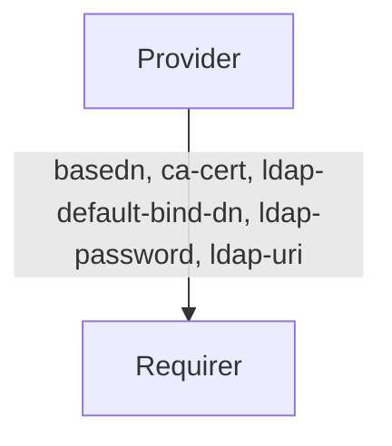

# `ldap_client`

## Usage

This relation interface describes the expected behavior of any charm claiming to be able to interface with an LDAP service as a client.

- Providers can expect to provide an LDAP configuration to the client upon relation.
- Requirers can expect to be able to connect to the LDAP service upon relation.

## Direction

The provider must send the requirer an LDAP configuration which consists of the following:



## Behavior

Both the Requirer and the Provider need to adhere to the criteria, to be considered compatible with the interface.

### Provider

- Is expected to have a config resource to supply an LDAP configuration if they do not want a default one.
- Is expected to have `api-port`, `ldap-port`, `ldap-search-base` config values. If the ports are not specified they have default values but the other two must be specified. 
- Is expected to provide three secrets `ca-cert`, `ldap-default-bind-dn`, `ldap-password`.

### Requirer

- Is expected to be able to connect to the LDAP service with the provided relation data.

## Relation Data

Describe the contents of the databags, and provide schemas for them.

[\[Pydantic Schema\]](./schema.py)

#### Example
Provide a yaml/json example of a valid databag state (for the whole relation).
```yaml
provider:
  app: {
    "basedn": "dc=glauth,dc=com",
    "ca-cert": <ca-cert file contents>,
    "ldap-default-bind-dn", "cn=serviceuser,ou=svcaccts,dc=glauth,dc=com",
    "ldap-password": "mysecret",
    "ldap-uri", "ldaps://jujuabc123-0:3894",
  }
```