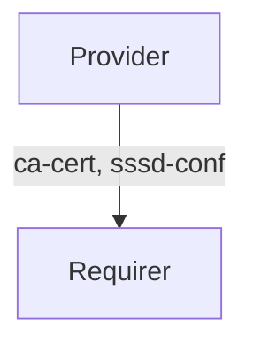

# `openldap`

## Usage
This relation interface describes the expected behavior of any charm claiming to be able to interact with the `OpenLDAP` directory service.

## Direction

The interface will consist of a provider and a requirer.
The `provider` is expected to allow access to an `OpenLDAP` directory. The `requirer` should be able to consume the relation and configure SSSD to authenticate to the `OpenLDAP` directory.



## Behavior

The `provider` needs to adhere to a certain set of criteria to be considered compatible with the interface.

### Provider

- Is expected to provide the `requirer` with the configuration for the preferred authentication mode; SSSD.
- Is expected to group any authentication config in a top-level key in the application databag.

### Requirer

- Is expected to allow configuration of authentication mode to `OpenLDAP` as specified by the `provider`. The modes and their configurations are described in OpenLDAP's [official documentation](https://www.openldap.org/doc/admin26/install.html#{{TERM[expand]TLS}})
- Is expected to configure OpenLDAP authentication as described by the `provider`.

## Relation Data

### Provider

[\[JSON Schema\]](./schemas/provider.json)

The `provider` provides the authentication mode and its configuration and required certificate.

#### Example

```json
```

### Requirer

[\[JSON Schema\]](./schemas/requirer.json)
The `requirer` charm needs not return any data to the `provider` or advertise it's LDAP authentication.
